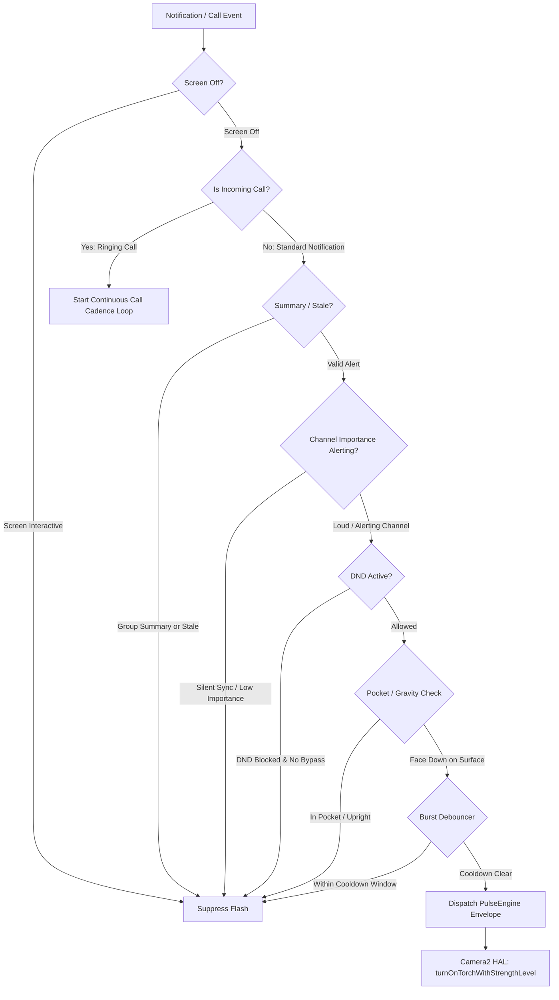

<div align="center">

# 💡 DimPulse
### Ambient Multi-Level LED Flash Notifications & Call Cadence Engine for Android 13+

[-3DDC84?logo=android&logoColor=white)](https://developer.android.com)
[](https://kotlinlang.org)
[](https://developer.android.com/jetpack/compose)
[](https://m3.material.io)
[](LICENSE)
[-success)](AndroidManifest.xml)

*Transform your rear LED flash into a subtle, organic, multi-level ambient notification indicator that mimics the Pixel HiLight experience on Android 13+ devices without blinding you in the dark.*

---

</div>

## 🌟 Philosophy & Core Capabilities

Traditional Android flash notification apps fire the rear LED torch at **100% maximum luminance** (~200+ lumens). In a dark room, meeting, or bedroom, this results in harsh, blinding flashes and unnecessary battery drain.

**DimPulse** leverages the Android 13+ Camera2 Hardware Flash Strength API (`turnOnTorchWithStrengthLevel`) to deliver:

- 💡 **Sub-milliamp Level 1 Ambient Glow:** A gentle, non-glare micro-blip visible on a desk without illuminating the whole room.
- 🌊 **Modular Light Profiles & Granular Timings:** Choose from *Breathing Glow*, *Crisp Pulse*, *Soft Fade-Out*, *Snappy Rise*, or define *Custom Millisecond Envelopes* with dual slider + direct numeric input.
- 📞 **Continuous Incoming Call Cadence Engine:** Loops rhythmic flash sequences (e.g. `.x.x.x ... .x.x.x`) for GSM & VoIP calls (WhatsApp, Telegram, etc.) while ringing, immediately terminating when answered or declined.
- 🛡️ **Alert Importance Filtering (Mute Silent Spam):** Intelligently ignores silent background syncs (e.g. Twitter/X timeline updates) while preserving real alerting messages even when your phone is in silent/vibrate mode.
- ⏱️ **Burst Rate Limit (Debounce):** Configurable rate limiter ($0\text{s} \leftrightarrow 30\text{s}$) preventing strobe flood from rapid chat messages.
- 🎯 **Per-App Customization:** Assign distinct waveforms, multipliers, speeds, and DND overrides to individual apps.
- 📱 **Smart App Filter:** Default view filters down to actual user applications (~25-50 apps) rather than 500+ system background daemons.
- 📐 **Sensor-Based Desk & Pocket Gating:** Accelerometer gravity vector and proximity occlusion filters ensure flashes only trigger when the phone is face-down on a surface.
- 🔒 **100% Offline & Private:** **Zero `INTERNET` permissions** in `AndroidManifest.xml`. Zero tracking, zero telemetry, zero background polling.

---

## 🎛️ Light Profiles & Granular Envelope Model

DimPulse models every flash pulse through a **4-stage millisecond timing envelope**:

```
 Luminance
    ▲
Peak│           ┌──────────┐  (Stay-On Time)
    │          /            \
    │         /              \
    │        / (Fade-In Rise) \ (Fade-Out Decay)
  0 └───────┴──────────────────┴─────────────► Time
                                 ◄──────────►
                               Inter-Pulse Gap
```

### 1. Preset Light Profiles:
| Profile | Fade-In Rise | Peak Hold (Stay-On) | Fade-Out Decay | Intra-Pulse Gap | Aesthetic Character |
| :--- | :--- | :--- | :--- | :--- | :--- |
| **Breathing Glow** | $200\text{ms}$ | $30\text{ms}$ | $200\text{ms}$ | $120\text{ms}$ | Smooth sinusoidal ambient rise and gentle fall |
| **Crisp Pulse** | $0\text{ms}$ | $100\text{ms}$ | $0\text{ms}$ | $120\text{ms}$ | Instant, sharp digital click |
| **Soft Fade-Out** | $25\text{ms}$ | $35\text{ms}$ | $280\text{ms}$ | $120\text{ms}$ | Instant attack with smooth analog decay |
| **Snappy Rise** | $280\text{ms}$ | $35\text{ms}$ | $0\text{ms}$ | $120\text{ms}$ | Gradual swelling rise with sharp cutoff |
| **Custom Shape** | User defined | User defined | User defined | User defined | Complete millisecond envelope customization |

### 2. Pulse Multipliers:
* `Single (1x)`, `Double (2x)`, `Triple (3x)`, `Quad (4x)`

---

## 📞 Incoming Call Cadence Engine

Unlike basic notifications that pulse once, incoming voice and video calls (GSM Phone, WhatsApp, Telegram, Instagram, Teams) trigger an ambient **ringing cadence loop**:

$$\underbrace{\text{.x .x .x}}_{\text{3x Flash Sequence}} \quad \xrightarrow{\text{Cadence Pause: 1500ms}} \quad \underbrace{\text{.x .x .x}}_{\text{3x Flash Sequence}} \quad \xrightarrow{\text{Cadence Pause: 1500ms}} \dots$$

* **Continuous Ring Cadence:** Keeps looping while the phone is ringing.
* **Cadence Interval Slider & Number Input:** Adjust pause time between sequence bursts ($500\text{ms} \leftrightarrow 4000\text{ms}$).
* **Instant Cancellation:** Immediately halts upon `onNotificationRemoved` when the call is answered, declined, or caller hangs up.

---

## 📐 Sensor & Decision Pipeline



---

## 📱 Hardware Compatibility

Optimized for devices with hardware-level LED current regulation:
* **Google Pixel 9 / Pixel 9 Pro / Pixel 9 Pro XL / Pixel 9 Pro Fold**
* **Google Pixel 7 / 7 Pro / 8 / 8 Pro / Fold / 8a**
* **Samsung Galaxy Devices on One UI 5+ (Android 13+)**
* **Any Android 13+ device** exposing `CameraCharacteristics.FLASH_INFO_STRENGTH_MAXIMUM_LEVEL > 1`

*(Devices supporting only binary torch gracefully fallback to micro-timed pulses).*

---

## 🛠️ Project Structure

```
dimnotif/
├── .github/workflows/
│   └── build-release.yml          # Automated CI/CD build, sign & release pipeline
├── app/
│   ├── build.gradle.kts           # Kotlin 2.1, Jetpack Compose 2025.01, SDK 35
│   └── src/main/
│       ├── AndroidManifest.xml     # Zero-INTERNET offline manifest with NotificationListener
│       ├── java/com/dimpulse/app/
│       │   ├── DimPulseApp.kt      # Application DI & lifecycle singleton
│       │   ├── data/               # Models (LightProfilePreset, CallFlashConfig, etc.) & DataStore
│       │   ├── engine/             # Camera2 FlashController, PulseEngine, ProximityHelper
│       │   ├── service/            # DimFlashNotificationListener service & call engine
│       │   └── ui/                 # Unified LedConfigurationEditor, Dashboard, Settings, AppList
└── README.md
```

---

## 🔒 Security & Privacy

* ❌ **NO `android.permission.INTERNET`**
* ❌ **NO `android.permission.CAMERA`** (uses sandboxed `CameraManager.turnOnTorchWithStrengthLevel`)
* ❌ **NO analytics, crash trackers, or external telemetry**
* ✅ **100% Free & Open Source under the MIT License**

---

<div align="center">
<b>DimPulse</b> — Crafted for precision, tranquility, and elegance.
</div>
