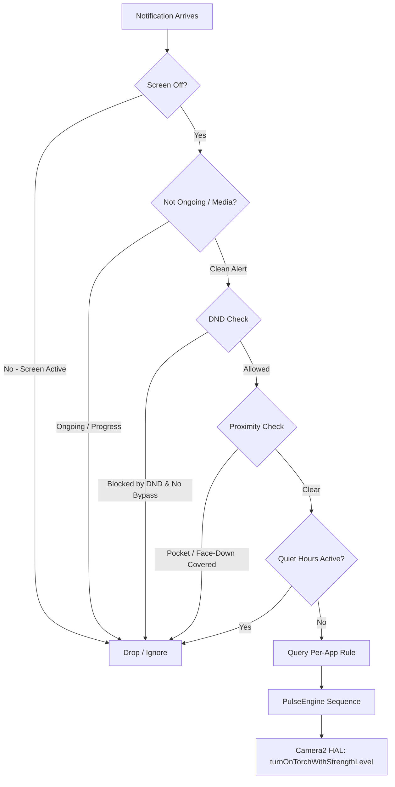

<div align="center">

# 💡 DimPulse
### Ambient LED Notification System Mimicking HiLight on Android 13+

[-3DDC84?logo=android&logoColor=white)](https://developer.android.com)
[](https://kotlinlang.org)
[](https://developer.android.com/jetpack/compose)
[](https://m3.material.io)
[](LICENSE)
[-success)](AndroidManifest.xml)
[-blueviolet)](https://deepmind.google/technologies/gemini/)

*Transform your rear LED flash into a subtle, organic, multi-level notification indicator that mimics the newly announced Pixel HiLight experience on Android 13+ devices without blinding you in the dark.*

---

</div>

> [!NOTE]  
> **AI Generation Attribution:** This repository, architecture, and entire codebase were architected, designed, and generated by **Gemini 3.7 Flash (High)**.

---

## 🌟 Key Features & Philosophy

Traditional Android flash notification apps fire the rear LED at **100% maximum luminance** (~200+ lumens). In a dark room or meeting, this causes blinding flashes and heavy battery drain.

**DimPulse mimics the Pixel HiLight experience** by leveraging the Android 13+ Camera2 Hardware Flash Strength API (`turnOnTorchWithStrengthLevel`) to deliver:
- 💡 **Sub-milliamp Level 1 Ambient Glow:** A gentle, non-glare micro-blip visible on a desk without illuminating the whole room.
- 🌊 **Organic Breathing Glow:** Smooth sinusoidal rise-and-fall luminance ramps (~400ms) stepped across discrete hardware levels.
- 🎯 **Per-App Customization:** Assign distinct waveforms and brightness levels to different applications (e.g. subtle single pulse for Slack, organic breathing for Phone calls).
- 🛡️ **Zero False Positives:** Intelligent multi-stage sensor pipeline (interactive screen-off gating, pocket & face-down proximity occlusion, Do Not Disturb, and quiet hours schedule).
- 🔒 **100% Offline & Private:** **Zero `INTERNET` permissions** in `AndroidManifest.xml`. Zero tracking, zero telemetry, zero background polling.

---

## 📐 System Architecture



---

## 🎛️ Pulse Waveforms & Mathematical Models

### 1. Discrete Multi-Pulse (Square Wave)
Used for standard alerts (Single, Double, Triple Pulse):
$$\text{Intensity}(t) = \begin{cases} L_{\text{target}} & \text{if } t \pmod{T_{\text{on}} + T_{\text{off}}} < T_{\text{on}} \\ 0 & \text{otherwise} \end{cases}$$

### 2. Organic Breathing Glow (Sinusoidal Stepped Wave)
Simulates an analog breathing notification LED:
$$L(k) = \text{round}\left( 1 + \frac{L_{\text{target}} - 1}{2} \cdot \left( 1 - \cos\left( \frac{2\pi k}{M} \right) \right) \right)$$
*Where $M = 16$ interpolation steps with 25ms delay per step.*

---

## 📱 Hardware Compatibility

Optimized for devices supporting multi-level flashlight current regulation:
* **Google Pixel 9 / Pixel 9 Pro / Pixel 9 Pro XL** (Tensor G4 Camera HAL)
* **Google Pixel 7 / 7 Pro / 8 / 8 Pro / Fold**
* **Samsung Galaxy Devices on One UI 5+ (Android 13+)**
* **Any Android 13+ device** exposing `CameraCharacteristics.FLASH_INFO_STRENGTH_MAXIMUM_LEVEL > 1`

*(Devices supporting only binary torch fallback to standard micro-timed pulses gracefully).*

---

## 🛠️ Project Structure

```
dimnotif/
├── .github/workflows/
│   └── build-release.yml          # Automated CI/CD: build, sign & release APK
├── app/
│   ├── build.gradle.kts           # App build config (Kotlin 2.1, Compose, SDK 35)
│   ├── proguard-rules.pro         # Proguard rules for serialization & compose
│   └── src/main/
│       ├── AndroidManifest.xml     # Offline manifest with NotificationListener
│       ├── java/com/dimpulse/app/
│       │   ├── DimPulseApp.kt      # Application DI & lifecycle singleton
│       │   ├── data/               # Models & Jetpack DataStore repository
│       │   ├── engine/             # Camera2 HAL bridge, PulseEngine, Sensors
│       │   ├── service/            # DimFlashNotificationListener service
│       │   ├── ui/                 # Material 3 Compose HUD, Studio & Settings
│       │   └── util/               # Permission & helper utilities
│       └── res/                    # Adaptive icons, vectors & themes
├── gradle/
│   ├── libs.versions.toml          # Version catalog
│   └── wrapper/                    # Gradle 8.11 wrapper
├── build.gradle.kts                # Root build configuration
├── settings.gradle.kts
└── README.md
```

---

## 🚀 Building from Source

### Cloud Build (GitHub Actions)
Push a tag (e.g. `v1.0.0`) or trigger the workflow manually from the **Actions** tab on GitHub. The pre-configured CI pipeline will automatically compile both Debug and Release APKs.

### Local Build
Requires **JDK 17+** and **Android SDK 35**:
```bash
# Clone the repository
git clone https://github.com/pcislocked/dimpulse.git
cd dimpulse

# Build Debug APK
./gradlew assembleDebug

# Build Release APK
./gradlew assembleRelease
```
The compiled APK will be located in `app/build/outputs/apk/debug/app-debug.apk`.

---

## 🔒 Security & Privacy

* ❌ **NO `android.permission.INTERNET`**
* ❌ **NO `android.permission.CAMERA`** (uses sandboxed `CameraManager.turnOnTorchWithStrengthLevel`)
* ❌ **NO analytics, crash reporters, or external network calls**
* ✅ **100% Free & Open Source under the MIT License**

---

<div align="center">
<b>DimPulse</b> — Crafted for precision, tranquility, and elegance.
</div>
