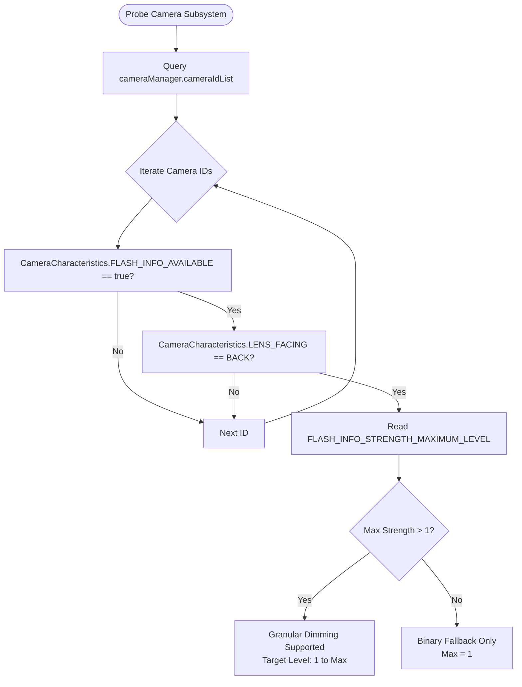
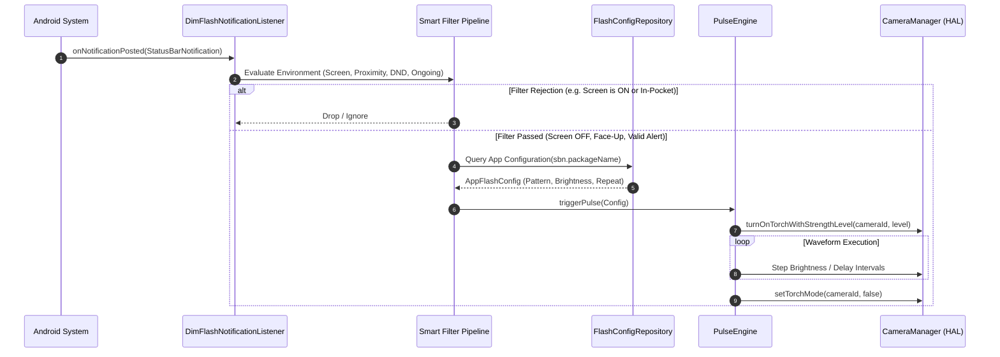
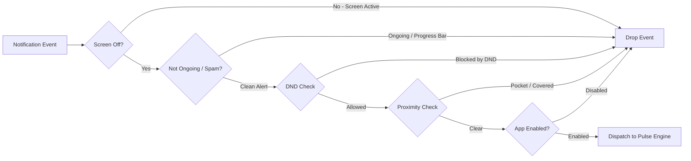

# DimPulse (Pixel Highlight) — Comprehensive Architectural Blueprint & Implementation Specification

> **System Target:** Android 13 (API Level 33) to Android 15+ (API Level 35+)  
> **Optimized Hardware:** Google Pixel 9 Pro (Tensor G4 Camera HAL) & Compatible Multi-Level Flash Devices  
> **Distribution Model:** 100% Offline, FOSS (Free and Open Source Software) via GitHub Releases / F-Droid  

---

## Table of Contents
1. [Executive Summary & Core Philosophy](#1-executive-summary--core-philosophy)
2. [Hardware Subsystem & Camera2 HAL Deep Dive](#2-hardware-subsystem--camera2-hal-deep-dive)
3. [End-to-End System Architecture](#3-end-to-end-system-architecture)
4. [Smart Filter & Zero-False-Positive Sensor Pipeline](#4-smart-filter--zero-false-positive-sensor-pipeline)
5. [Pulse & Breathing Waveform Engine](#5-pulse--breathing-waveform-engine)
6. [Per-App Customization & Rule Engine](#6-per-app-customization--rule-engine)
7. [UI/UX Architecture (Jetpack Compose & Material 3)](#7-uiux-architecture-jetpack-compose--material-3)
8. [Security, Privacy, and Background Lifecycle Management](#8-security-privacy-and-background-lifecycle-management)
9. [Detailed Project Directory Structure](#9-detailed-project-directory-structure)
10. [Build Toolchain, Dependencies & Version Catalog](#10-build-toolchain-dependencies--version-catalog)
11. [GitHub CI/CD & Automated Release Pipeline](#11-github-cicd--automated-release-pipeline)
12. [Verification Matrix & Pixel 9 Pro Test Cases](#12-verification-matrix--pixel-9-pro-test-cases)

---

## 1. Executive Summary & Core Philosophy

### 1.1 The Problem
Legacy "Flash Notification" applications on Android and the native accessibility flash alert feature suffer from severe limitations:
1. **Binary Strobe Only:** They rely on `CameraManager.setTorchMode(id, true)`, triggering the rear LED at 100% maximum luminance (~150–300 lumens). In dark environments, this produces blinding strobes that are disruptive, battery-heavy, and unsuited for subtle ambient alerts.
2. **Lack of Per-App Context:** A low-priority Discord meme triggers the exact same violent flash as an urgent phone call or 2FA SMS.
3. **No Organic Dynamics:** Binary toggling produces abrupt square-wave flashes rather than smooth, elegant breathing pulses.

### 1.2 The Solution: DimPulse
**DimPulse** is an ambient LED alert system for Android 13+ devices. It leverages the Camera2 hardware flash strength API (`turnOnTorchWithStrengthLevel`) to transform the rear LED into a granular, low-intensity notification indicator mimicking dedicated physical notification LEDs.

```
┌─────────────────────────────────────────────────────────────────────────────┐
│                          DIMPULSE CORE VALUES                                │
├──────────────────────────┬──────────────────────────┬───────────────────────┤
│    Zero Blinding Flash   │     Zero Cloud / Telemetry│   Zero Battery Drain  │
│  Hardware level 1 is     │  100% offline, no internet│  Event-driven listener│
│  ultra-subtle & ambient  │  permission in manifest   │  with sensor gating   │
└──────────────────────────┴──────────────────────────┴───────────────────────┘
```

---

## 2. Hardware Subsystem & Camera2 HAL Deep Dive

### 2.1 The Camera2 Torch Strength API
Introduced in Android 13 (API 33), `CameraManager` allows direct control over LED current regulation without opening a camera capture session or acquiring the camera preview hardware lock.

```kotlin
// Android 13+ Granular Torch API Signature
fun turnOnTorchWithStrengthLevel(cameraId: String, torchStrength: Int)
```

#### Capability Probing Sequence:


### 2.2 Tensor G4 / Pixel 9 Pro Hardware Characteristics
On the Google Pixel 9 Pro:
- **Rear LED Module:** Multi-die high-CRI auxiliary LED integrated with the camera sensor ISP.
- **Maximum Strength Level (`FLASH_INFO_STRENGTH_MAXIMUM_LEVEL`):** Multi-level quantization (typically levels `1` through `10` or `1` through `128` depending on the HAL build).
- **Default Level (`FLASH_INFO_STRENGTH_DEFAULT_LEVEL`):** Standard flashlight default (~50–70% of max).
- **Minimum Level (`Level 1`):** Sub-milliamp driving current providing an ultra-dim, non-glare micro-glow visible across a table without illuminating an entire room.

### 2.3 Hardware Conflicts & Concurrency Safeguards
The LED hardware is a shared system resource. DimPulse implements `CameraManager.TorchCallback` to resolve state contention:

1. **User Flashlight Override:** If the user toggles the system Flashlight Quick Settings tile, DimPulse immediately aborts all active notification pulse routines and yields control.
2. **Camera App Override:** If the Camera app is launched (e.g. taking a photo or video), the camera HAL automatically revokes torch access. DimPulse catches `CameraAccessException` gracefully without crashing.
3. **Thermal & Hardware Watchdog:** To prevent hardware wear or infinite loops, every pulse sequence is bound by a hardware watchdog coroutine that guarantees `setTorchMode(id, false)` after a maximum hard timeout of 5,000ms.

---

## 3. End-to-End System Architecture



---

## 4. Smart Filter & Zero-False-Positive Sensor Pipeline

To ensure the LED only flashes when genuinely useful, incoming notifications pass through a strict, multi-stage processing pipeline:



### 4.1 Filter Specifications

| Filter Layer | API / Method Used | Purpose |
| :--- | :--- | :--- |
| **1. Screen State** | `PowerManager.isInteractive` | If the user is actively using their phone, the screen already provides visual feedback. Flash is suppressed. |
| **2. Ongoing / Media Filter** | `sbn.isOngoing` & `Notification.FLAG_ONGOING_EVENT` | Blocks Spotify, foreground downloads, navigation, step counters, and system persistent services. |
| **3. Group Summary Deduplication** | `Notification.FLAG_GROUP_SUMMARY` | Prevents double-flashing when WhatsApp/Telegram posts both an individual message and a summary header. |
| **4. Do Not Disturb (DND)** | `NotificationManager.currentInterruptionFilter` | Respects Priority Only, Alarms Only, and Total Silence modes (with per-app bypass toggles for emergencies). |
| **5. Pocket & Face-Down Detection** | `Sensor.TYPE_PROXIMITY` (one-shot sampling) | Polls the proximity sensor for 150ms upon notification arrival. If covered (in pocket or face-down), flash is suppressed. |
| **6. Quiet Hours Schedule** | `LocalTime.now()` comparison against user schedule | Automatically mutes or forces Level 1 between custom hours (e.g. 22:00 to 07:00). |

---

## 5. Pulse & Breathing Waveform Engine

### 5.1 Waveform Mathematical Models

#### Pattern 1: Discrete Multi-Pulse (Square Wave)
Used for standard alerts (e.g., Double Blink, Triple Blink):

$$\text{Intensity}(t) = \begin{cases} L_{\text{target}} & \text{if } t \pmod{T_{\text{on}} + T_{\text{off}}} < T_{\text{on}} \\ 0 & \text{otherwise} \end{cases}$$

Where $T_{\text{on}} \approx 100\text{ms}$, $T_{\text{off}} \approx 120\text{ms}$, repeated $N$ times.

#### Pattern 2: Organic Breathing Glow (Sinusoidal Stepped Wave)
Simulates a smooth analog breathing pulse by dynamically stepping through discrete hardware strength levels:

$$L(k) = \text{round}\left( 1 + \frac{L_{\text{target}} - 1}{2} \cdot \left( 1 - \cos\left( \frac{2\pi k}{M} \right) \right) \right)$$

Where:
- $M$ = total number of interpolation steps (e.g., 16 steps)
- $k \in [0, M]$ = current step index
- Step delay = $\approx 25\text{ms}$ per step, yielding a smooth 400ms organic rise-and-fall glow.

```
Intensity (Level)
  ▲
L │         ╭───╮
  │       ╭─╯   ╰─╮
  │     ╭─╯       ╰─╮
1 │ ────╯           ╰──── (Off)
  └────────────────────────► Time (ms)
    0   100  200  300  400
```

#### Pattern 3: Rapid Strobe / Urgency Waveform
High-frequency bursts ($T_{\text{on}} = 40\text{ms}$, $T_{\text{off}} = 50\text{ms}$) reserved for emergency alerts, phone calls, or alarm triggers.

---

### 5.2 Pulse Engine Concurrency Architecture

```kotlin
class PulseEngine(
    private val flashController: FlashController,
    private val scope: CoroutineScope = CoroutineScope(Dispatchers.Default + SupervisorJob())
) {
    private var activeJob: Job? = null
    private val mutex = Mutex()

    fun executePattern(pattern: FlashPattern, strengthLevel: Int) {
        scope.launch {
            mutex.withLock {
                activeJob?.cancelAndJoin()
                activeJob = launch {
                    try {
                        withTimeout(5000L) { // Safety watchdog: 5s hard cutoff
                            when (pattern.type) {
                                PatternType.SINGLE_PULSE -> runDiscrete(count = 1, strengthLevel, on = 120L, off = 0L)
                                PatternType.DOUBLE_PULSE -> runDiscrete(count = 2, strengthLevel, on = 100L, off = 120L)
                                PatternType.TRIPLE_PULSE -> runDiscrete(count = 3, strengthLevel, on = 90L, off = 100L)
                                PatternType.BREATHING    -> runBreathing(maxLevel = strengthLevel, cycles = 1, stepMs = 25L)
                                PatternType.RAPID_STROBE -> runDiscrete(count = 4, strengthLevel, on = 40L, off = 50L)
                            }
                        }
                    } finally {
                        flashController.turnOff()
                    }
                }
            }
        }
    }
}
```

---

## 6. Per-App Customization & Rule Engine

### 6.1 Data Schema

```kotlin
@Serializable
data class AppFlashConfig(
    val packageName: String,
    val appName: String,
    val isEnabled: Boolean = true,
    val patternType: PatternType = PatternType.DOUBLE_PULSE,
    val strengthLevel: Int = 1, // 1 = lowest/ambient
    val repeatCount: Int = 1,    // Repetitions per notification
    val repeatIntervalSeconds: Int = 0, // 0 = no repeat nag
    val bypassDnd: Boolean = false,
    val customOnDurationMs: Long = 100L,
    val customOffDurationMs: Long = 120L
)

@Serializable
data class GlobalFlashSettings(
    val masterEnabled: Boolean = true,
    val defaultPattern: PatternType = PatternType.DOUBLE_PULSE,
    val defaultStrength: Int = 1,
    val onlyWhenScreenOff: Boolean = true,
    val proximitySensorEnabled: Boolean = true,
    val respectDnd: Boolean = true,
    val quietHoursEnabled: Boolean = false,
    val quietHoursStartMinutes: Int = 22 * 60, // 22:00
    val quietHoursEndMinutes: Int = 7 * 60     // 07:00
)
```

### 6.2 App Discovery & Resolution Pipeline
1. Scan all installed packages providing a launcher intent or notification channels via `PackageManager`.
2. Cache application icons and user-friendly labels asynchronously.
3. When a notification arrives from `com.whatsapp`:
   - Check if an explicit `AppFlashConfig` exists for `com.whatsapp`.
   - If found and `isEnabled == true`, use its custom pattern & brightness.
   - If not configured, inherit from `GlobalFlashSettings`.

---

## 7. UI/UX Architecture (Jetpack Compose & Material 3)

The interface follows **Material 3 Expressive** guidelines with full Pixel dynamic theming support (Monet).

```
┌─────────────────────────────────────────────────────────────────┐
│  DimPulse                                        ⚙️ Settings   │
├─────────────────────────────────────────────────────────────────┤
│  ┌───────────────────────────────────────────────────────────┐  │
│  │ 💡 Service Status: ACTIVE               [ Master Toggle ] │  │
│  │    Rear Flash ID: 0 | Hardware Max Levels: 10             │  │
│  └───────────────────────────────────────────────────────────┘  │
│                                                                 │
│  ┌───────────────────────────────────────────────────────────┐  │
│  │ ⚡ Live Test Drive                                         │  │
│  │ Pattern: [ Breathing ▼ ]   Brightness Level: [ ──●───── 2 ]│  │
│  │                      [ 🔘 TEST FLASH ]                    │  │
│  └───────────────────────────────────────────────────────────┘  │
│                                                                 │
│  App Profiles                                    🔍 Search Apps │
│  ┌───────────────────────────────────────────────────────────┐  │
│  │ 💬 WhatsApp               Double Pulse • Level 1   [ ON ] │  │
│  │ 📞 Phone (Calls)          Breathing • Level 4      [ ON ] │  │
│  │ 📨 Messages               Single Pulse • Level 1   [ ON ] │  │
│  │ 🎮 Discord                Rapid Strobe • Level 2   [ ON ] │  │
│  │ ➕ Add App Rule...                                         │  │
│  └───────────────────────────────────────────────────────────┘  │
└─────────────────────────────────────────────────────────────────┘
```

### 7.1 Key Screen Breakdown
1. **Dashboard / HUD:**
   - Real-time permission status chips (Notification Access, Battery Unrestricted).
   - Instant hardware diagnostic card showing detected camera sensor, flash availability, and max dimming steps.
2. **Interactive Live Test Drive Studio:**
   - Sliders for brightness (1 to Max) and duration.
   - Pattern selector pills (Single, Double, Triple, Breathing, Strobe).
   - Dedicated "Test Flash" button triggering the physical LED instantly so users can test brightness without leaving the app.
3. **App Rules Manager & Bottom Sheet Editor:**
   - Searchable list of all installed user and system applications.
   - Tap any app to open a smooth Material 3 Bottom Sheet containing per-app brightness sliders, pattern selectors, and DND bypass toggles.
4. **Settings Screen:**
   - Sensor switches: Screen-off gating, Pocket proximity check.
   - Quiet Hours time-picker range.

---

## 8. Security, Privacy, and Background Lifecycle Management

### 8.1 Zero Special Privileges
- **No Internet Permission:** `<uses-permission android:name="android.permission.INTERNET" />` is **completely omitted** from `AndroidManifest.xml`. It is mathematically impossible for the app to leak notification content or telemetry.
- **No Camera Permission:** Operates solely via `CameraManager` torch mode, which requires zero camera runtime or manifest permissions.
- **Notification Access:** Uses the sandboxed `NotificationListenerService` API.

### 8.2 OEM Battery Survival Strategy
On Android, background processes are aggressively killed by OEM battery management systems. DimPulse survives via:
1. **Persistent System Binding:** Android's `NotificationManagerService` maintains a persistent system binder to `NotificationListenerService`, automatically relaunching it if the process dies.
2. **Battery Optimization Exemption:** In-app one-tap prompt for `ACTION_REQUEST_IGNORE_BATTERY_OPTIMIZATIONS`.
3. **Zero Polling / Zero Wakelocks:** The app consumes 0.0% CPU when idle; it is entirely event-driven.

---

## 9. Detailed Project Directory Structure

```
DimPulse/
├── .github/
│   └── workflows/
│       └── build-release.yml           # Automated CI/CD: build, sign & release APK
├── app/
│   ├── build.gradle.kts                # App-level build config, dependencies & SDKs
│   ├── proguard-rules.pro              # Code shrinking & obfuscation rules
│   └── src/
│       ├── main/
│       │   ├── AndroidManifest.xml      # Service definitions & feature flags
│       │   ├── java/com/dimpulse/app/
│       │   │   ├── DimPulseApp.kt       # Application class (DI / Singleton init)
│       │   │   ├── data/
│       │   │   │   ├── model/
│       │   │   │   │   ├── AppFlashConfig.kt
│       │   │   │   │   ├── FlashPattern.kt
│       │   │   │   │   └── PatternType.kt
│       │   │   │   └── repository/
│       │   │   │       ├── FlashConfigRepository.kt
│       │   │   │       └── PreferencesSerializer.kt
│       │   │   ├── engine/
│       │   │   │   ├── FlashController.kt        # CameraManager hardware bridge
│       │   │   │   ├── PulseEngine.kt            # Coroutine waveform & breathing animator
│       │   │   │   ├── ProximitySensorHelper.kt  # In-pocket & face-down detector
│       │   │   │   └── HardwareDiagnostics.kt    # Camera & flash capability probe
│       │   │   ├── service/
│       │   │   │   └── DimFlashNotificationListener.kt  # System notification interceptor
│       │   │   ├── ui/
│       │   │   │   ├── MainActivity.kt
│       │   │   │   ├── theme/
│       │   │   │   │   ├── Color.kt
│       │   │   │   │   ├── Theme.kt
│       │   │   │   │   └── Type.kt
│       │   │   │   ├── viewmodel/
│       │   │   │   │   ├── MainViewModel.kt
│       │   │   │   │   └── AppListViewModel.kt
│       │   │   │   ├── screens/
│       │   │   │   │   ├── DashboardScreen.kt
│       │   │   │   │   ├── AppListScreen.kt
│       │   │   │   │   ├── PatternEditorSheet.kt
│       │   │   │   │   └── SettingsScreen.kt
│       │   │   │   └── components/
│       │   │   │       ├── LivePreviewCard.kt
│       │   │   │       ├── HardwareStatusHUD.kt
│       │   │   │       └── AppConfigItem.kt
│       │   │   └── util/
│       │   │       ├── PermissionUtils.kt
│       │   │       └── Extensions.kt
│       │   └── res/
│       │       ├── drawable/            # Vector icons (torch, pulse, settings)
│       │       ├── mipmap-*/            # Pixel-adaptive launcher icons
│       │       └── values/
│       │           ├── strings.xml
│       │           └── themes.xml
├── gradle/
│   ├── wrapper/
│   │   ├── gradle-wrapper.jar
│   │   └── gradle-wrapper.properties
│   └── libs.versions.toml               # Gradle version catalog (Compose, Kotlin, AGP)
├── build.gradle.kts                     # Root project build file
├── settings.gradle.kts                  # Project settings & repositories
├── .gitignore
├── LICENSE                              # MIT License
└── README.md                            # Open-source showcase & documentation
```

---

## 10. Build Toolchain, Dependencies & Version Catalog

### 10.1 Version Catalog (`gradle/libs.versions.toml`)

```toml
[versions]
agp = "8.8.0"
kotlin = "2.1.0"
compose-bom = "2025.01.00"
core-ktx = "1.15.0"
lifecycle = "2.8.7"
datastore = "1.1.2"
kotlinx-serialization = "1.7.3"
coroutines = "1.10.1"

[libraries]
androidx-core-ktx = { group = "androidx.core", name = "core-ktx", version.ref = "core-ktx" }
androidx-lifecycle-runtime-compose = { group = "androidx.lifecycle", name = "lifecycle-runtime-compose", version.ref = "lifecycle" }
androidx-lifecycle-viewmodel-compose = { group = "androidx.lifecycle", name = "lifecycle-viewmodel-compose", version.ref = "lifecycle" }
androidx-compose-bom = { group = "androidx.compose", name = "compose-bom", version.ref = "compose-bom" }
androidx-compose-ui = { group = "androidx.compose.ui", name = "ui" }
androidx-compose-ui-tooling = { group = "androidx.compose.ui", name = "ui-tooling" }
androidx-compose-material3 = { group = "androidx.compose.material3", name = "material3" }
androidx-compose-material-icons = { group = "androidx.compose.material", name = "material-icons-extended" }
androidx-datastore-preferences = { group = "androidx.datastore", name = "datastore-preferences", version.ref = "datastore" }
kotlinx-serialization-json = { group = "org.jetbrains.kotlinx", name = "kotlinx-serialization-json", version.ref = "kotlinx-serialization" }
kotlinx-coroutines-android = { group = "org.jetbrains.kotlinx", name = "kotlinx-coroutines-android", version.ref = "coroutines" }

[plugins]
android-application = { id = "com.android.application", version.ref = "agp" }
kotlin-android = { id = "org.jetbrains.kotlin.android", version.ref = "kotlin" }
kotlin-compose = { id = "org.jetbrains.kotlin.plugin.compose", version.ref = "kotlin" }
kotlin-serialization = { id = "org.jetbrains.kotlin.plugin.serialization", version.ref = "kotlin" }
```

### 10.2 Build Configuration (`app/build.gradle.kts`)
- `minSdk = 33` (Android 13 Tiramisu, required for hardware torch strength API)
- `targetSdk = 35` (Android 15)
- `compileSdk = 35`
- Java Target: `JavaVersion.VERSION_17`

---

## 11. GitHub CI/CD & Automated Release Pipeline

A production-ready GitHub Actions workflow (`.github/workflows/build-release.yml`) to automatically compile and release unsigned/debug and signed release APKs on Git tag pushes.

```yaml
name: Build & Release DimPulse APK

on:
  push:
    tags:
      - 'v*'
  workflow_dispatch:

jobs:
  build:
    runs-on: ubuntu-latest
    permissions:
      contents: write
    steps:
      - name: Checkout Code
        uses: actions/checkout@v4

      - name: Set up JDK 17
        uses: actions/setup-java@v4
        with:
          distribution: 'temurin'
          java-version: '17'
          cache: 'gradle'

      - name: Grant Execute Permission for Gradlew
        run: chmod +x gradlew

      - name: Build Debug APK
        run: ./gradlew assembleDebug

      - name: Build Release APK
        run: ./gradlew assembleRelease

      - name: Upload Artifacts
        uses: actions/upload-artifact@v4
        with:
          name: DimPulse-APKs
          path: app/build/outputs/apk/**/*.apk

      - name: Create GitHub Release
        uses: softprops/action-gh-release@v2
        if: startsWith(github.ref, 'refs/tags/')
        with:
          files: |
            app/build/outputs/apk/debug/app-debug.apk
            app/build/outputs/apk/release/app-release-unsigned.apk
          generate_release_notes: true
```

---

## 12. Verification Matrix & Pixel 9 Pro Test Cases

| Test Case ID | Target Feature | Procedure | Expected Outcome |
| :--- | :--- | :--- | :--- |
| **TC-01** | Hardware Detection | Launch app on Pixel 9 Pro. | HUD displays `Rear Camera ID: 0`, `Max Strength > 1`, and status `Granular Dimming Ready`. |
| **TC-02** | Level 1 Flash Intensity | Press "Test Flash" with slider at Level 1. | Rear LED emits an ultra-dim micro-blip with zero high-intensity blinding strobe. |
| **TC-03** | Breathing Waveform | Select "Breathing Glow" in Test Drive and trigger preview. | Rear LED ramps brightness smoothly up and down across steps over ~400ms. |
| **TC-04** | Screen-Off Filter | Send notification with screen ON vs screen LOCKED. | Flash is suppressed when screen is ON; flash triggers immediately when screen is LOCKED. |
| **TC-05** | In-Pocket Suppression | Cover the top bezel (proximity sensor) while locked and send notification. | Flash is suppressed completely while sensor is occluded. |
| **TC-06** | Per-App Differentiation | Configure WhatsApp = Level 1 Double Pulse, Phone = Level 4 Triple Pulse. Send test notifications from both. | WhatsApp blinks twice softly; Phone call blinks three times noticeably brighter. |
| **TC-07** | Camera App Contention | Open native Camera app in video mode; trigger notification. | Notification listener catches hardware contention without crash or frame drops. |
| **TC-08** | Watchdog Safety Cutoff | Simulate abnormal coroutine hang. | Hardware watchdog forces `setTorchMode(id, false)` strictly at 5,000ms. |
